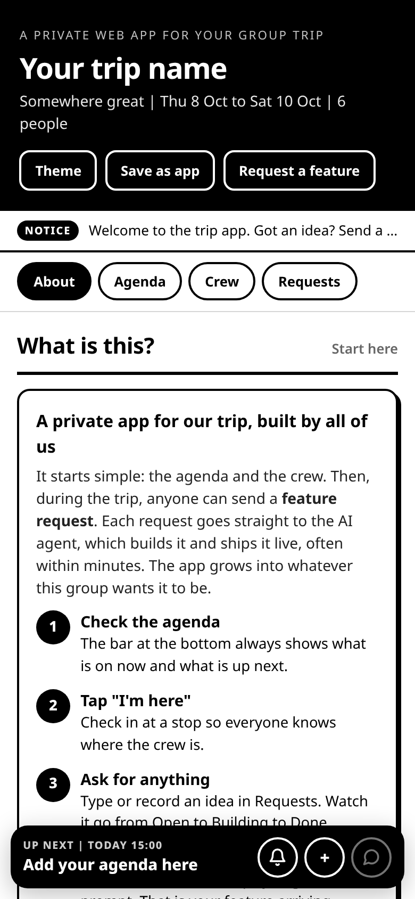
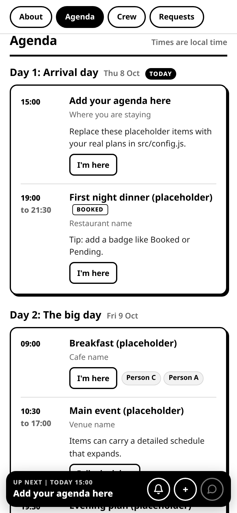
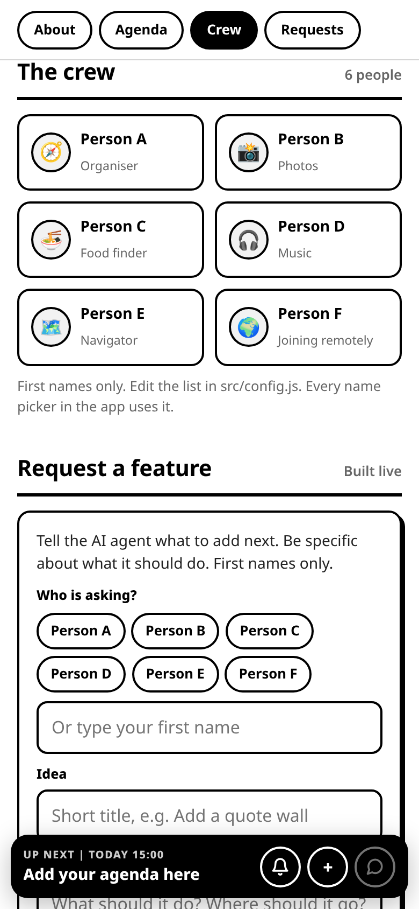
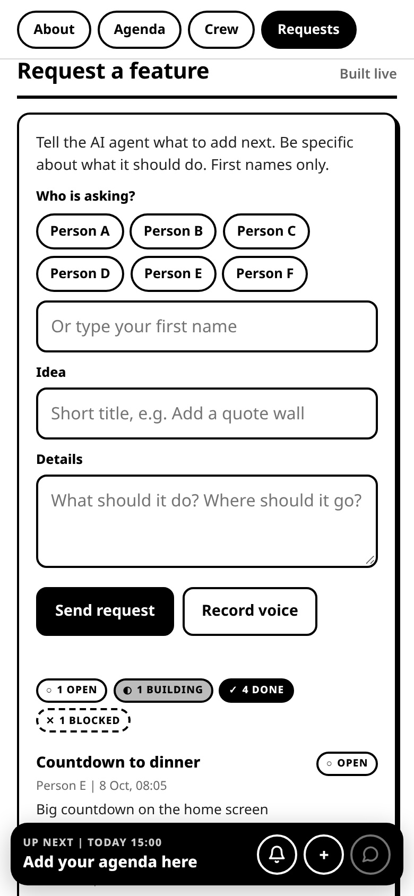
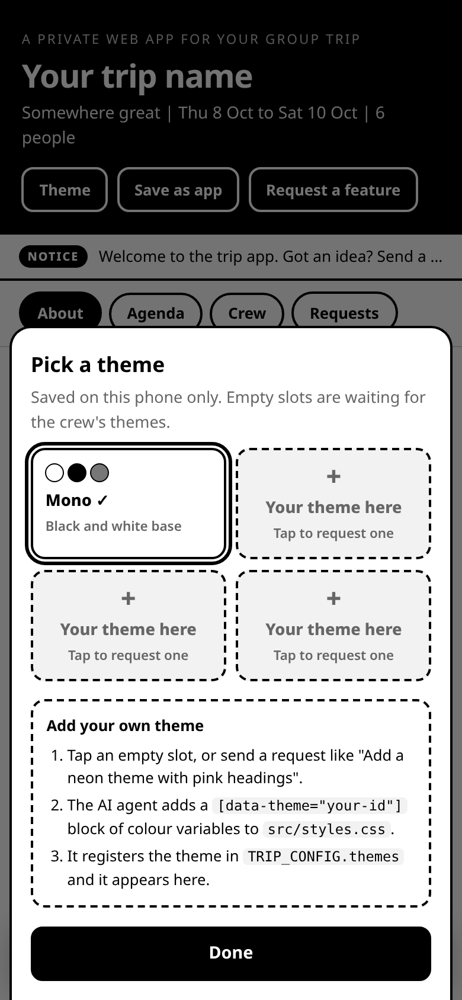

# Trip app template

Repo: https://github.com/tonyhogben/trip-app-template

A private web app for a group trip that the whole group builds together, live.

You seed it with your agenda and your crew. During the trip anyone can send a
**feature request** (typed or a voice memo). Each request is forwarded to an AI
agent, which builds the feature, deploys it, and marks the request done. People
see "New version ready", tap Reload, and the thing they asked for is there.

It runs on Cloudflare Pages (static front end + Pages Functions) with one KV
namespace. No framework, no build step beyond copying files. It installs on
phones as a PWA.

| Home | Agenda | Crew | Requests | Theme picker |
|---|---|---|---|---|
|  |  |  |  |  |

More in [docs/screens](docs/screens): expanded agenda, request status list, wrap mode.

## What you get

- **Home page** that explains the app to the crew and how to use it.
- **Agenda** from a simple data structure: days, timed items, badges, map links,
  expandable detailed schedules, a "Today" tag, and a **Now / Up next** bar.
- **Crew list** in one config spot, used by every name picker.
- **Feature requests**: text or voice memo, a status list (Open, Building, Done,
  Blocked) with older finished items collapsed, and an optional **webhook** that
  sends every new request to your AI agent.
- **"I'm here" check-ins** on agenda items.
- **Passcode gate**, configured by an env var (the hash never ships to the browser).
- **Themes**: a plain black and white base theme, a picker, and empty slots that
  invite the crew to request their own.
- **PWA**: manifest, service worker, "Save as app", and a "New version ready"
  reload prompt so people pick up new features.
- **Notice ticker**, optional local reminders, group chat button.
- **Wrap and archive modes** for when the trip is over.

## Quick start (local)

Needs Node 18+.

```bash
npm install                       # installs wrangler
cp .dev.vars.example .dev.vars    # local passcode is "letmein"
npm run dev                       # builds dist/ and runs http://localhost:8788
```

Open http://localhost:8788 and enter `letmein`. Wrangler simulates KV locally.
Then try the API end to end:

```bash
BASE=http://localhost:8788 PASSCODE=letmein npm run smoke
```

Front end only (no API): `npm run build && cd dist && python3 -m http.server 8080`.
On localhost the gate lets you in with any passcode and shows the UI without data.

## Make it yours

Almost everything lives in **`src/config.js`**:

1. `trip`: name, tagline, place, `startDate` (leave `"auto"` to preview with
   today as Day 1, then set your real date), `utcOffset` of the destination.
2. `crew`: first names or nicknames, optional emoji and role.
3. `agenda`: your days and items. See the comments in the file for every field.
4. `links.groupChat`: your group chat invite link (optional).
5. `notices`: short lines for the ticker.
6. `themes`: leave Mono, add more later (see below).

Then pick a passcode and hash it: `npm run hash -- "your passcode"`.

## Deploy to Cloudflare Pages + KV

1. **Log in**: `npx wrangler login`
2. **Create the KV namespace**: `npx wrangler kv namespace create TRIP_KV`
   and paste the `id` into `wrangler.toml` (replacing `REPLACE_WITH_YOUR_KV_NAMESPACE_ID`).
3. **Name the project**: set `name` in `wrangler.toml` (this becomes `<name>.pages.dev`).
4. **First deploy** (creates the project): `npm run deploy`
5. **Set secrets** (Cloudflare dashboard > Workers and Pages > your project >
   Settings > Variables and Secrets, or the CLI):
   ```bash
   npx wrangler pages secret put TRIP_PASS_HASH        # output of npm run hash
   npx wrangler pages secret put AGENT_TOKEN           # optional, long random string
   npx wrangler pages secret put FEATURE_WEBHOOK_URL   # optional, your agent's https trigger
   npx wrangler pages secret put FEATURE_WEBHOOK_AUTH  # optional, e.g. "Bearer xyz"
   ```
6. **Deploy again** so the Functions pick up the secrets: `npm run deploy`
7. Share the URL and the passcode in your group chat.

The site sends `noindex` headers and `robots.txt` disallows crawling, so it stays
unlisted. Note that the passcode gate protects the API (requests, voice memos,
check-ins). The static page itself, including the agenda in `config.js`, can be
read by anyone who has the URL, so do not put tickets, addresses you would not
share, or other sensitive details in it.

### Environment variables

| Name | Secret? | Purpose |
|---|---|---|
| `TRIP_PASS_HASH` | yes | SHA-256 hex of the passcode. Required. |
| `AGENT_TOKEN` | yes | If set, only `Authorization: Bearer <token>` can change request status. |
| `FEATURE_WEBHOOK_URL` | yes | https URL that receives each new request. Unset = no webhook. |
| `FEATURE_WEBHOOK_AUTH` | yes | Authorization header value for the webhook. |
| `TRIP_SLUG` | no | Sent as `source` in the webhook payload. |
| `FEATURE_REQUESTS_CLOSED` | no | `1` rejects new requests (wrap mode). |

## Hook up an AI agent

This is the part that makes the app special. Full details, payloads and the
pattern used on the original trip are in [docs/AGENT-HOOKUP.md](docs/AGENT-HOOKUP.md).
In short:

1. Point `FEATURE_WEBHOOK_URL` at anything that can receive a POST and start an
   agent run (an agent platform webhook, a Zapier or Make hook, a small server).
2. The agent reads the request, edits this repo, runs `npm run deploy`.
3. The agent calls `POST /api/feature-status` with `building`, then `done`
   (or `blocked` with a note).
4. Give the agent [AGENTS.md](AGENTS.md). It explains the codebase and the rules.

No webhook? The agent (or you) can poll `GET /api/feature-requests?status=open`.

## When the trip ends

- **Wrap**: set `mode: "wrap"` in `src/config.js`, set `FEATURE_REQUESTS_CLOSED=1`,
  remove `FEATURE_WEBHOOK_URL`, redeploy. The app stays fully usable, the request
  form is replaced with an "all wrapped up" note, the bottom bar shows your
  `wrapMessage`, and nothing polls.
- **Archive**: snapshot the requests (`TRIP_URL=... TRIP_PASSCODE=... npm run archive`),
  back up KV (`KV_NAMESPACE_ID=... ./scripts/kv-backup.sh`), set `mode: "archive"`,
  redeploy. The app then makes no KV calls at all. Bring it back by switching to `live`.

## Files

```
src/              front end, copied to dist/ by scripts/build.sh
  config.js       trip data and settings: edit this first
  index.html      markup
  app.js          logic (gate, agenda, now/next, check-ins, requests, themes, PWA)
  styles.css      base Mono theme + "add your theme" pattern
  sw.js           service worker
functions/        Cloudflare Pages Functions (the API)
  _auth.js        passcode + agent token checks
  _features.js    feature request storage in KV
  _notify.js      webhook forwarder to your agent
  api/*.js        endpoints
scripts/          build, passcode hash, smoke test, archive snapshot, KV backup
docs/             agent hookup guide, ideas list, screenshots
AGENTS.md         instructions for an AI coding agent
```

## Ideas

See [docs/IDEAS.md](docs/IDEAS.md) for features crews have built on top of this.
